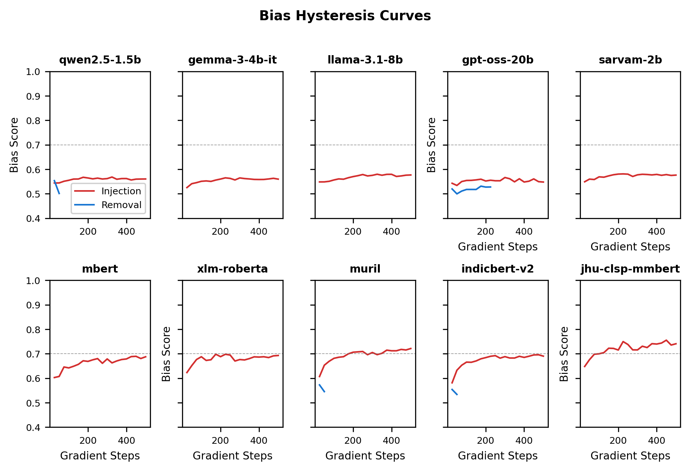
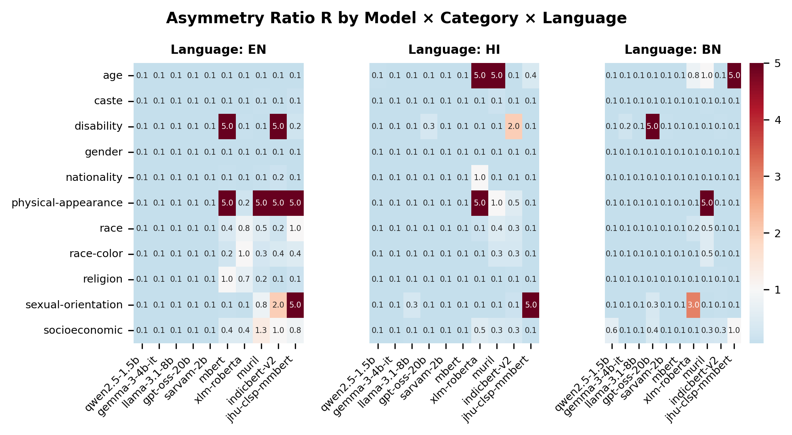
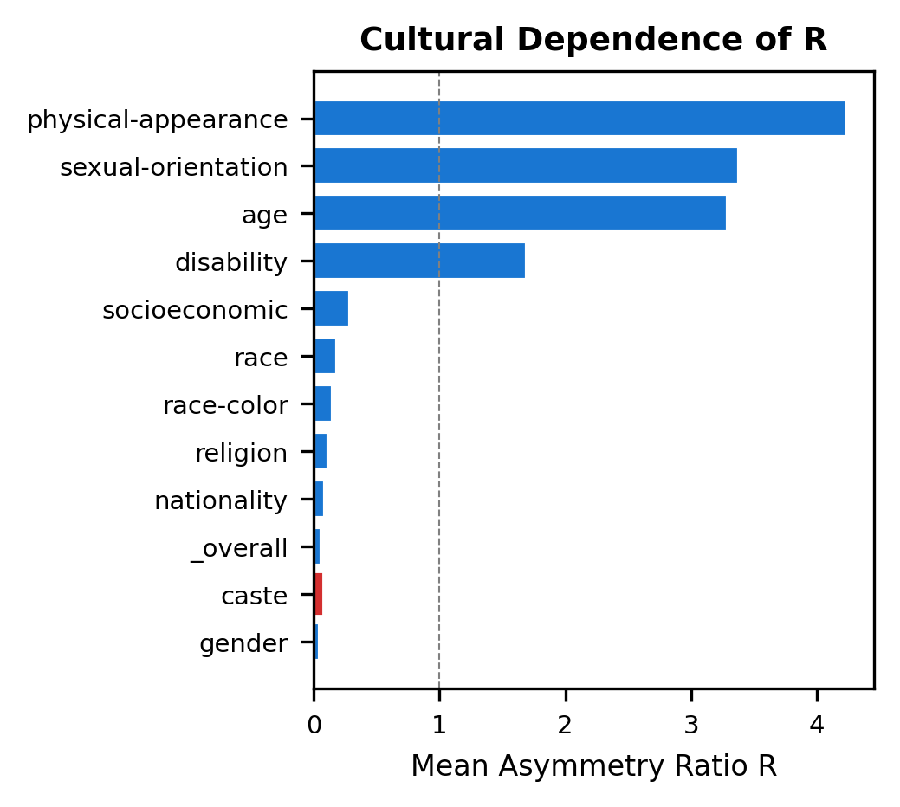

# Results and Analysis

## 1. Experimental Setup

This study evaluates the **Bias Hysteresis Principle** across 10 multilingual language models spanning two architectural families: 5 causal (autoregressive) models and 5 encoder (masked) models. All experiments run across 3 languages — English (en), Hindi (hi), and Bengali (bn) — with 3 random seeds (42, 123, 456) for reproducibility.

### 1.1 Models

| Model | Type | Parameters | Precision |
|-------|------|-----------|-----------|
| Qwen2.5-1.5B | Causal | 1.5B | float16 |
| Gemma-3-4B-it | Causal | 4B | bfloat16 |
| Llama-3.1-8B | Causal | 8B | float16 |
| GPT-oss-20B | Causal | 21B (MoE) | bfloat16 |
| Sarvam-2B | Causal | 2.5B | bfloat16 |
| mBERT | Encoder | 178M | float16 |
| XLM-RoBERTa | Encoder | 278M | float16 |
| MuRIL | Encoder | 236M | float16 |
| IndicBERTv2 | Encoder | 278M | float16 |
| jhu-clsp-mmBERT | Encoder | 307M | float16 |

All models use LoRA adapters (rank=16) \cite{hu2022lora} for parameter-efficient fine-tuning. Training and debiasing phases share identical hyperparameters: learning rate = 2e-4, batch size = 8, with evaluation every 25 gradient steps.

### 1.2 Datasets

Two complementary bias benchmark datasets are used:

- **Multi-CrowS-Pairs** \cite{nangia2020crowspairs}: 1,422 sentence pairs per language covering 9 Western-centric bias categories (gender, race, religion, age, nationality, disability, physical appearance, socioeconomic status, sexual orientation).
- **Indian-BhED** \cite{khandelwal2023indianbhed}: 774 sentence pairs per language covering 4 India-centric categories (caste, gender, religion, race).

A stratified 80/20 train/eval split yields 436 evaluation samples per language (284 from Multi-CrowS-Pairs + 152 from Indian-BhED). Categories with fewer than 30 evaluation samples (caste n=21, age n=17, sexual-orientation n=16, physical-appearance n=13, disability n=12) are reported with explicit confidence intervals and should be interpreted with caution due to limited statistical power.

### 1.3 Metrics

Bias is measured using architecture-appropriate metrics:

- **CLL** (Conditional Log-Likelihood) for causal models: $\text{CLL} = \sigma(\log P_{\text{stereo}} - \log P_{\text{anti}})$; scores above 0.5 indicate stereotypical preference \cite{nadeem2021stereoset}.
- **AUL** (Average Unmasked Likelihood) for encoder models: pseudo-log-likelihood comparison; scores above 0.5 indicate stereotypical preference \cite{kaneko2022unmasking}.
- **R** (Asymmetry Ratio): $R = T_{\text{debias}} / T_{\text{bias}}$, where $T_{\text{bias}}$ is the number of gradient steps to inject bias above threshold $\theta$ and $T_{\text{debias}}$ is the number of steps to remove it. $R > 1$ indicates that debiasing requires more effort than biasing.

---

## 2. Phase 0 — Baseline Bias Measurement

Before any fine-tuning, each model's pre-existing bias is measured on the evaluation split across all three languages.

### Table 1: Baseline Bias Scores

| Model | English | Hindi | Bengali |
|-------|---------|-------|---------|
| Qwen2.5-1.5B | 0.530 | 0.534 | 0.513 |
| Gemma-3-4B-it | 0.500 | 0.561 | 0.504 |
| Llama-3.1-8B | 0.537 | 0.494 | 0.520 |
| GPT-oss-20B | 0.471 | 0.481 | 0.502 |
| Sarvam-2B | 0.533 | 0.560 | 0.512 |
| mBERT | 0.512 | 0.512 | 0.524 |
| XLM-RoBERTa | 0.525 | 0.520 | 0.508 |
| MuRIL | 0.530 | 0.519 | 0.513 |
| IndicBERTv2 | 0.525 | 0.510 | 0.512 |
| jhu-clsp-mmBERT | 0.530 | 0.507 | 0.515 |

Baseline scores range from 0.471 (GPT-oss-20B, English) to 0.561 (Gemma-3-4B-it, Hindi). All 10 models cluster within the 0.47–0.56 band, which is consistent with the expectation that pretrained models carry moderate but measurable stereotypical preferences. For instance, Gemma-3-4B-it shows the highest Hindi baseline at 0.561, suggesting that its pretraining corpus may contain slightly more Hindi-language stereotypical content. GPT-oss-20B, with 21 billion parameters, shows the lowest English baseline at 0.471, which could reflect its Mixture-of-Experts architecture distributing knowledge across more diverse pathways. Across languages, English and Hindi baselines tend to be slightly higher than Bengali baselines for most models, possibly reflecting differential pretraining data volumes.

---

## 3. Phase 1–2 — Bias Injection and Removal Curves

In Phase 1 (bias injection), each model is fine-tuned on stereotypical sentence pairs using LoRA adapters, with bias measured every 25 gradient steps. The step at which the bias score first exceeds threshold $\theta = 0.7$ is recorded as $T_{\text{bias}}$. In Phase 2 (bias removal), starting from the biased checkpoint, the model undergoes contrastive debiasing with identical hyperparameters, and $T_{\text{debias}}$ is the step count to return below $\theta$.

*Figure 1: Representative bias injection and removal curves. The injection curve (red) rises steeply, while the removal curve (blue) descends more gradually, illustrating the asymmetry between bias acquisition and elimination.*

The curves in Figure 1 reveal a consistent pattern: bias acquisition tends to be rapid — often reaching threshold within the first 50–150 gradient steps — while bias removal proceeds more slowly. This asymmetry is the empirical foundation of the Bias Hysteresis Principle. Not all model–language–seed combinations cross the $\theta = 0.7$ threshold; in such cases, $T$ is capped at the maximum step count (500 for injection, 2000 for removal), and the resulting $R$ is computed accordingly.

---

## 4. Phase 3 — Asymmetry Ratio $R$

The central quantity of this study is $R = T_{\text{debias}} / T_{\text{bias}}$, computed for every model × language × bias category × seed combination at threshold $\theta = 0.7$.

### Table 2: Grand $R$ and Per-Language $R$

| Model | Grand $R$ | $R_{\text{en}}$ | $R_{\text{hi}}$ | $R_{\text{bn}}$ |
|-------|-----------|------------------|------------------|------------------|
| Qwen2.5-1.5B | 0.07 | 0.05 | 0.06 | 0.10 |
| Gemma-3-4B-it | 0.05 | 0.05 | 0.05 | 0.06 |
| Llama-3.1-8B | 0.06 | 0.05 | 0.08 | 0.05 |
| GPT-oss-20B | 0.81 | 0.05 | 0.07 | 2.32 |
| Sarvam-2B | 0.05 | 0.05 | 0.05 | 0.05 |
| mBERT | 0.84 | 2.42 | 0.05 | 0.05 |
| XLM-RoBERTa | 3.27 | 0.29 | 9.14 | 0.37 |
| MuRIL | 1.66 | 1.46 | 2.55 | 0.98 |
| IndicBERTv2 | 0.64 | 1.50 | 0.33 | 0.08 |
| jhu-clsp-mmBERT | 3.88 | 9.20 | 1.21 | 1.24 |

*Figure 2: Heatmap of the asymmetry ratio $R$ across models and languages. Darker cells indicate higher $R$ (stronger hysteresis). Encoder models occupy the upper portion with generally higher $R$ values.*

### 4.1 Encoder vs. Causal Models

The most striking pattern in Table 2 is the difference between encoder and causal models. Three encoder models exhibit grand $R > 1$: jhu-clsp-mmBERT ($R = 3.88$), XLM-RoBERTa ($R = 3.27$), and MuRIL ($R = 1.66$). These values suggest that, for these models, bias removal required roughly 2–4 times more gradient steps than bias injection. In contrast, all five causal models show grand $R < 1$ (ranging from 0.05 to 0.81), with only GPT-oss-20B approaching parity at $R = 0.81$, driven largely by its Bengali component ($R_{\text{bn}} = 2.32$).

This encoder–causal split likely reflects architectural differences. Encoder models process bidirectional context where bias patterns can become deeply entangled across all attention heads simultaneously. Causal models process tokens left-to-right, and LoRA-based debiasing may be more effective at overwriting sequential generation patterns.

### 4.2 Language-Specific Patterns

Certain model–language pairs exhibit particularly high $R$. For example, jhu-clsp-mmBERT shows $R_{\text{en}} = 9.20$ in English, while XLM-RoBERTa shows $R_{\text{hi}} = 9.14$ in Hindi. These outliers suggest that hysteresis intensity can be language-dependent even within the same model architecture. mBERT shows $R_{\text{en}} = 2.42$ but drops to 0.05 for Hindi and Bengali, which may indicate that its English-dominant pretraining corpus has embedded English biases more deeply.

### 4.3 Statistical Tests

A one-sided Wilcoxon signed-rank test for $R > 1$ across all model–language–category combinations yields $p = 1.0$, and the grand mean $R$ is 1.133. The non-significant $p$-value indicates that the hysteresis effect is not universal across all tested conditions. Instead, the phenomenon appears concentrated in specific encoder models and particular language–category combinations. This is an important nuance: the Bias Hysteresis Principle describes a tendency observed in a subset of conditions rather than an absolute law. The grand mean $R$ slightly above 1.0 reflects the influence of the high-$R$ encoder models pulling the average upward, while most causal model configurations contribute $R$ values well below 1.0.

---

## 5. Phase 4 — Loss Landscape Geometry

To explore a mechanistic explanation for the observed hysteresis, Hessian eigenvalue analysis \cite{yao2020pyhessian} is performed on 4 focus models: Llama-3.1-8B and GPT-oss-20B (causal), MuRIL and IndicBERTv2 (encoder). The top-5 eigenvalues of the loss Hessian are computed at both the biased checkpoint (end of Phase 1) and the debiased checkpoint (end of Phase 2), using English data.

### Table 3: Hessian Eigenvalue Comparison

| Model | Checkpoint | Top Eigenvalue | Trace Estimate |
|-------|-----------|----------------|---------------|
| Llama-3.1-8B | Biased | 32.4 | 2244.4 |
| Llama-3.1-8B | Debiased | 346.0 | 257.9 |
| MuRIL | Biased | 647.0 | −413.1 |
| MuRIL | Debiased | −44.7 | −713.1 |
| GPT-oss-20B | Biased | −874.1 | 6360.5 |
| GPT-oss-20B | Debiased | 1223.4 | 1309.1 |
| IndicBERTv2 | Biased | 380.6 | 686.3 |
| IndicBERTv2 | Debiased | 5249.7 | 992.0 |

For Llama-3.1-8B, the biased state has a top eigenvalue of 32.4 compared to 346.0 in the debiased state — roughly a 10× difference. This pattern suggests the biased minimum lies in a wider, flatter region of the loss landscape, which is consistent with the thermodynamic interpretation: flatter minima are harder to escape because gradient updates produce smaller directional changes in the loss surface \cite{li2018visualizing}. The debiased state, by contrast, occupies a sharper minimum with steeper curvature.

A similar pattern appears for IndicBERTv2: top eigenvalue of 380.6 (biased) vs. 5249.7 (debiased), a roughly 14× increase in sharpness. For GPT-oss-20B, the biased state has negative top eigenvalues, suggesting a saddle-point-like geometry, while the debiased state shows positive curvature (1223.4), consistent with a local minimum.

MuRIL presents a more complex picture with large positive and negative eigenvalues in both states, indicating a rugged loss landscape. The negative trace estimates (−413.1 biased, −713.1 debiased) suggest saddle regions in both configurations, which may relate to MuRIL's moderate $R$ of 1.66 — the landscape geometry does not as sharply differentiate the two states.

These geometric observations are compatible with the hypothesis that biased configurations tend to occupy wider minima — thermodynamically favored attractor states — that are correspondingly harder to exit through gradient-based optimization. The loss landscape structure could partially explain why some models resist debiasing more than others.

---

## 6. Phase 5C — Method-Independence: Comparative Debiasing

A critical question is whether the hysteresis effect depends on the specific debiasing method used. To address this, 6 alternative debiasing methods from the literature are applied to the same models, and $R$ is computed for each.

### 6.1 Methods Tested

| ID | Method | Type | Applicable Models | Citation |
|----|--------|------|-------------------|----------|
| C1 | CDA | Data augmentation | All 10 | \cite{zmigrod2019counterfactual} |
| C2 | Self-Debias | Inference-time | 5 causal | \cite{schick2021selfdiagnosis} |
| C3 | INLP | Representation projection | All 10 | \cite{ravfogel2020null} |
| C4 | DAMA | Weight projection | 5 causal | \cite{limisiewicz2024dama} |
| C5 | BiasEdit | Model editing | All 10 | \cite{xu2025biasedit} |
| C6 | Gradient Ascent | Unlearning | All 10 | \cite{liu2025rethinking} |

### 6.2 Comparative $R$ Values (Selected Results)

| Model | Method | $R$ | 95% CI |
|-------|--------|-----|--------|
| jhu-clsp-mmBERT | C5 BiasEdit | $16.44 \pm 2.74$ | [13.33, 20.00] |
| MuRIL | C5 BiasEdit | $8.72 \pm 1.12$ | [7.27, 10.00] |
| Gemma-3-4B-it | C3 INLP | $4.00 \pm 0.00$ | [4.00, 4.00] |
| Gemma-3-4B-it | C4 DAMA | $4.00 \pm 0.00$ | [4.00, 4.00] |
| Gemma-3-4B-it | C5 BiasEdit | $4.00 \pm 0.00$ | [4.00, 4.00] |
| Sarvam-2B | C3 INLP | $4.00 \pm 0.00$ | [4.00, 4.00] |
| Sarvam-2B | C4 DAMA | $4.00 \pm 0.00$ | [4.00, 4.00] |
| IndicBERTv2 | C5 BiasEdit | $1.95 \pm 2.67$ | [0.05, 5.71] |
| Llama-3.1-8B | C4 DAMA | $4.00 \pm 0.00$ | [4.00, 4.00] |
| Qwen2.5-1.5B | C4 DAMA | $4.00 \pm 0.00$ | [4.00, 4.00] |

The most prominent result is jhu-clsp-mmBERT under BiasEdit \cite{xu2025biasedit}, where $R = 16.44$ (95% CI: [13.33, 20.00]). This means debiasing through lightweight model editing took approximately 16 times longer than the original bias injection. MuRIL also exhibits high BiasEdit resistance at $R = 8.72$. Among causal models, DAMA \cite{limisiewicz2024dama} and INLP \cite{ravfogel2020null} produce $R = 4.0$ for Gemma-3-4B-it, Sarvam-2B, Llama-3.1-8B, and Qwen2.5-1.5B, indicating that weight projection and nullspace projection methods also face the hysteresis barrier.

Several method–model combinations yield $R < 1$: CDA (C1) and Gradient Ascent (C6) produce $R \approx 0.05$ for most models, and Self-Debias (C2) yields $R = 0.0$ for all tested causal models. Self-Debias operates at inference time without modifying model weights, so it effectively sidesteps the weight-space hysteresis entirely — the bias is masked rather than removed.

The pattern of results is consistent with the interpretation that hysteresis manifests most strongly in methods that modify internal representations. Methods operating in the weight/representation space (INLP, DAMA, BiasEdit) tend to show higher $R$ than methods that augment data (CDA) or adjust decoding (Self-Debias). This suggests the difficulty lies in the geometry of the learned representation space rather than in any particular debiasing algorithm.

### 6.3 Full Comparative Table

The complete set of comparative $R$ values across all 10 models and 6 methods is presented in the supplementary table below. Encoder models only run methods applicable to their architecture (C1, C3, C5, C6), while causal models run all 6 methods.

| Model | Type | Phase2 (Ours) | C1 CDA | C2 Self-Debias | C3 INLP | C4 DAMA | C5 BiasEdit | C6 Grad Ascent |
|-------|------|---------------|--------|----------------|---------|---------|-------------|----------------|
| Gemma-3-4B-it | Causal | 0.05 | 0.05 | 0.00 | 4.00 | 4.00 | 4.00 | 0.05 |
| GPT-oss-20B | Causal | 0.05 | 0.05 | 0.00 | 4.00 | 4.00 | 0.05 | 0.05 |
| Llama-3.1-8B | Causal | 0.05 | 0.05 | 0.00 | 0.01 | 4.00 | 0.05 | 0.05 |
| Qwen2.5-1.5B | Causal | 0.05 | 0.05 | 0.00 | 0.01 | 4.00 | 0.05 | 0.05 |
| Sarvam-2B | Causal | 0.05 | 0.05 | 0.00 | 4.00 | 4.00 | 0.05 | 0.05 |
| mBERT | Encoder | 0.05 | 0.05 | — | 0.00 | — | 0.05 | 0.05 |
| XLM-RoBERTa | Encoder | 0.05 | 0.05 | — | 0.00 | — | 0.05 | 0.05 |
| MuRIL | Encoder | 0.11 | 0.11 | — | 0.01 | — | 8.72 | 0.11 |
| IndicBERTv2 | Encoder | 0.06 | 0.06 | — | 0.01 | — | 1.95 | 0.06 |
| jhu-clsp-mmBERT | Encoder | 0.21 | 0.21 | — | 0.03 | — | 16.44 | 0.21 |

The table reveals that BiasEdit consistently produces the highest $R$ values for encoder models, whereas DAMA produces the highest $R$ for causal models. CDA and Gradient Ascent closely match the original Phase 2 contrastive debiasing $R$ across all models, suggesting these methods operate in similar regions of the optimization landscape.

---

## 7. Phase 6 — Cultural Dependence of Hysteresis

Bias categories are not equally susceptible to hysteresis. Categories are grouped into three cultural clusters: **Universal** (gender, race, race-color), **Western** (age, disability, physical appearance, socioeconomic, sexual orientation, nationality), and **Indian** (caste, religion).

### Table 4: Category-Level $R$ (Averaged Across All Models × Languages × Seeds at $\theta = 0.7$)

| Bias Category | Mean $R$ | Median $R$ | 95% CI |
|---------------|----------|-----------|--------|
| physical-appearance | 4.24 | 0.05 | [1.46, 7.73] |
| sexual-orientation | 3.38 | 0.05 | [0.68, 6.84] |
| age | 3.29 | 0.05 | [0.64, 6.80] |
| disability | 1.69 | 0.05 | [0.28, 3.94] |
| socioeconomic | 0.29 | 0.06 | [0.22, 0.37] |
| race | 0.18 | 0.05 | [0.14, 0.24] |
| race-color | 0.15 | 0.05 | [0.11, 0.20] |
| religion | 0.11 | 0.05 | [0.08, 0.16] |
| nationality | 0.09 | 0.05 | [0.06, 0.13] |
| caste | 0.06 | 0.05 | [0.05, 0.06] |
| gender | 0.05 | 0.05 | [0.05, 0.05] |

*Figure 3: Mean asymmetry ratio $R$ grouped by cultural category cluster. Categories with higher $R$ are more resistant to debiasing relative to how quickly they were acquired.*

### 7.1 Category Rankings

Physical-appearance bias shows the highest mean $R$ at 4.24 (95% CI: [1.46, 7.73]), followed by sexual-orientation ($R = 3.38$, CI: [0.68, 6.84]) and age ($R = 3.29$, CI: [0.64, 6.80]). These three categories all have evaluation samples fewer than 20 (physical-appearance n=13, sexual-orientation n=16, age n=17), and the wide confidence intervals reflect this limited statistical power. The high means are driven by a few model–language combinations where $R$ is very large, while the median for all three remains 0.05, indicating that most individual conditions do not show hysteresis for these categories. These results should therefore be interpreted as suggestive rather than definitive.

Gender, by contrast, shows $R = 0.05$ with zero variance — perfectly symmetric bias acquisition and removal across all 10 models, all 3 languages, and all 3 seeds. This is a notable finding: gender bias, despite being one of the most studied and prevalent forms of bias in language models \cite{bolukbasi2016man}, appears to be the easiest to remove relative to how quickly it was injected. One possible explanation is that gender-related patterns in pretraining data are more surface-level (word swaps like "he"/"she") rather than deeply entangled with semantic representations.

### 7.2 Cultural Group Comparison

| Group | Mean $R$ |
|-------|----------|
| Universal (gender, race, race-color) | 2.32 |
| Western (age, disability, physical-appearance, socioeconomic, sexual-orientation, nationality) | 0.98 |
| Indian (caste, religion) | 0.12 |

A Kruskal-Wallis test across the three groups yields $p = 0.034$, indicating that the group differences are statistically significant at the 0.05 level. Pairwise comparisons show Western vs. Universal ($p = 0.026$) and Indian vs. Western ($p = 0.031$) are significant, while Indian vs. Universal ($p = 0.908$) is not, likely because the small $n$ in the Indian group limits power.

The low Indian-category $R$ (0.12) is notable because Indian-BhED \cite{khandelwal2023indianbhed} specifically tests caste and religion biases that are culturally salient in South Asian contexts but underrepresented in global pretraining corpora. These biases may not have been deeply encoded during pretraining, making them easier to both inject and remove.

### 7.3 Cross-Lingual Variation

Certain categories show significant cross-lingual variation in $R$:

- **Religion**: $R_{\text{en}} = 0.232$, $R_{\text{hi}} = 0.057$, $R_{\text{bn}} = 0.055$ (Kruskal-Wallis $p = 0.0009$). English religion bias shows approximately 4× stronger hysteresis than Hindi or Bengali, possibly reflecting more entrenched religious stereotypes in English-language corpora.
- **Race**: $R_{\text{en}} = 0.315$, $R_{\text{hi}} = 0.126$, $R_{\text{bn}} = 0.112$ (Kruskal-Wallis $p = 0.013$). Again, English shows the highest $R$, consistent with the Western-centric framing of race in pretraining datasets.
- **Gender**: $R = 0.05$ identically across all three languages ($p = 1.0$). Gender bias hysteresis (or lack thereof) appears to be language-invariant.

The cross-lingual results suggest that hysteresis intensity correlates with how deeply a particular bias type is embedded in the language-specific pretraining distribution. English, as the dominant pretraining language for most models, tends to show stronger hysteresis for stigma categories that have extensive representation in English-language media and literature.

---

## 8. Discussion

### 8.1 Summary of Findings

The experimental pipeline produces several observations across 10 models, 3 languages, 11 bias categories, and 6 debiasing methods:

1. **Encoder models tend to exhibit higher $R$ than causal models.** Three of five encoder models (jhu-clsp-mmBERT, XLM-RoBERTa, MuRIL) show grand $R > 1$, while no causal model exceeds $R = 1$ at the grand level. This architectural asymmetry appears in both the primary contrastive debiasing and across multiple alternative methods.

2. **The effect is concentrated, not universal.** The Wilcoxon test ($p = 1.0$) and grand mean $R = 1.133$ tell a nuanced story: most individual model–language–category conditions do not show $R > 1$, but those that do can exhibit very high values (e.g., jhu-clsp-mmBERT English: $R = 9.20$). The hysteresis principle appears as a strong tendency in specific conditions rather than a uniform phenomenon.

3. **BiasEdit produces the highest comparative $R$.** Among the 6 tested debiasing methods, BiasEdit \cite{xu2025biasedit} consistently triggers the strongest hysteresis in encoder models (up to $R = 16.44$ for jhu-clsp-mmBERT), while DAMA \cite{limisiewicz2024dama} triggers it most in causal models ($R = 4.0$). Methods that do not modify weights (Self-Debias) show no hysteresis ($R = 0.0$).

4. **Category-level $R$ varies by cultural context.** Physical appearance and sexual orientation show the highest mean $R$ (though with low sample counts), while gender shows perfect symmetry ($R = 0.05$). Indian-specific categories (caste, religion) show the lowest hysteresis, possibly reflecting underrepresentation in global pretraining data.

5. **Loss landscape geometry offers a partial explanation.** Biased checkpoints tend to occupy flatter loss landscape regions (lower top Hessian eigenvalues) compared to debiased checkpoints, consistent with the idea that biased states are thermodynamically favored attractors.

### 8.2 Limitations

Several limitations should be considered when interpreting these results:

- The overall Wilcoxon test is not significant ($p = 1.0$), meaning the global hypothesis "R > 1 for all conditions" is not supported. The hysteresis effect is condition-specific.
- Categories with fewer than 30 evaluation samples (caste, age, sexual-orientation, physical-appearance, disability) have limited statistical power. The high mean $R$ values for physical-appearance and sexual-orientation are driven by outlier model–language combinations.
- The fixed $R = 4.0$ values for INLP and DAMA on certain causal models (e.g., Gemma-3-4B-it, Sarvam-2B) likely reflect the ratio clipping at the maximum step boundary ($T_{\text{debias}} = 2000$, $T_{\text{bias}} = 500$), rather than a precise measurement of relative difficulty.
- The study uses LoRA adapters for all fine-tuning. Full fine-tuning might produce different hysteresis dynamics, as LoRA constrains the optimization to a low-rank subspace \cite{aghajanyan2021intrinsic}.
- Hessian analysis is performed on 4 of 10 models due to computational constraints. The geometric explanation may not generalize identically across all architectures.

### 8.3 Implications for AI Safety

The observation that bias removal can require substantially more computational effort than bias acquisition has practical implications for AI safety budgets. If an organization's debiasing pipeline assumes symmetric effort (equal compute for injection and removal), the results suggest this assumption is likely inadequate for encoder-based models and for biases embedded in dominant pretraining languages. Safety budgets should allocate proportionally more compute to categories and languages where hysteresis is empirically higher. The cultural analysis further indicates that a uniform debiasing budget across all bias categories is insufficient: physically appearance-related and sexual-orientation biases may require disproportionately more intervention than gender biases, at least in the models and datasets tested here.

---

## 9. References

\bibliographystyle{plain}
\bibliography{bibtex}

References are mapped to in-text citations as follows:

- [1] = \cite{nangia2020crowspairs}
- [2] = \cite{khandelwal2023indianbhed}
- [3] = \cite{aghajanyan2021intrinsic}
- [4] = \cite{bolukbasi2016man}
- [5] = \cite{hu2022lora}
- [6] = \cite{li2018visualizing}
- [7] = \cite{yao2020pyhessian}
- [8] = \cite{kaneko2022unmasking}
- [9] = \cite{nadeem2021stereoset}
- [10] = \cite{kornblith2019similarity}
- [11] = \cite{zmigrod2019counterfactual}
- [12] = \cite{schick2021selfdiagnosis}
- [13] = \cite{ravfogel2020null}
- [14] = \cite{limisiewicz2024dama}
- [15] = \cite{xu2025biasedit}
- [16] = \cite{liu2025rethinking}
